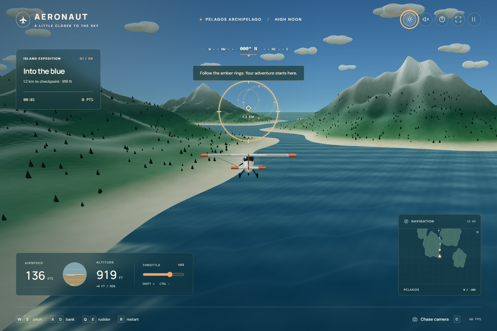

# AERONAUT

A cinematic, playable browser flight game set in the fictional Pelagos archipelago. Built with TypeScript, Three.js, and Vite. The aircraft, terrain, trees, clouds, airfield, water, and checkpoint rings are generated in code.

**[Play AERONAUT](https://johnfabian.github.io/flight-sim-codex/)** — open the link, choose a flight, and select **Let’s fly**. No installation or account required. Keyboard and touch controls are supported.



## Run locally

Requires Node.js 22.12+ or 24+.

```sh
npm install
npm run dev
```

Open the local URL printed by Vite (normally http://localhost:5173). For a phone on the same Wi-Fi, use the computer's LAN IP and port 5173. The development server binds to all interfaces; your firewall must allow access on your private network.

```sh
npm test          # deterministic flight simulation checks
npm run build    # TypeScript checks and production build
npm run preview  # serve the production build
```

With the development server running and Microsoft Edge installed, `npm run test:smoke` verifies the desktop and emulated touch flows and captures screenshots to `.artifacts/`.

## Play

Choose **Island expedition** to fly eight checkpoints in sequence, or **Free flight** to explore. The flight starts airborne at a safe cruise altitude. Centered checkpoint passes earn more points. Your best completed expedition score is saved on this browser.

| Control | Action |
| --- | --- |
| S / Down arrow | Pitch up (pull back) |
| W / Up arrow | Pitch down |
| A / D or Left / Right | Bank and turn |
| Q / E | Rudder left / right |
| Shift / Ctrl | Increase / decrease throttle |
| C | Cycle chase, cockpit, and wing cameras |
| Esc / P | Pause / resume |
| H | Controls |
| R | Restart flight |
| M | Mute / unmute |
| F | Fullscreen, where supported |

On touch screens, drag the flight stick down to climb, up to descend, and sideways to bank. Adjust the throttle slider to change power. Landscape is recommended, and portrait is supported. The sun button switches between golden hour and midday.

Release steering to gently return to level flight. Climb before the mountain checkpoints. Slow flight can stall; increase throttle to recover. Terrain or water contact ends the flight and offers a restart. Switching tabs pauses the simulation.

## Build and hosting

`npm run build` produces a static `dist/` directory. Serve it with any static HTTPS host. No backend, API keys, account, Docker, or runtime model service is needed. Optional Google Fonts fall back to system fonts when unavailable. All game assets and dependencies are bundled locally.

GitHub Pages publishes at https://johnfabian.github.io/flight-sim-codex/. The `Deploy game to GitHub Pages` workflow tests, builds, and deploys updates pushed to `main`; it can also be run manually from Actions. Repository Settings → Pages must use **GitHub Actions** as its source. Relative build asset paths keep the game working under the repository URL and on other static hosts.

To run the existing desktop/mobile smoke checks against a production preview or the live site, set `SMOKE_BASE_URL` to its full URL before running `npm run test:smoke`. Microsoft Edge is required. See [the deployment plan](docs/DEPLOYMENT.md) for release verification and rollback.

An optional Docker configuration serves the production build on port 8080:

```sh
docker compose up --build -d
```

Open http://localhost:8080. Stop with `docker compose down`.

## Implementation

- `src/simulation.ts`: deterministic terrain, flight state, time-based dynamics, collisions, and checkpoint scoring.
- `src/world.ts`: Three.js world, procedural scenery, aircraft geometry, shaders, lighting, and cameras.
- `src/main.ts`: HUD, keyboard/touch input, game lifecycle, minimap, and local best score.
- `src/audio.ts`: throttle-responsive synthesized engine and checkpoint chimes.
- `src/style.css`: responsive aviation interface.
- `PLAN.md`: the plan written before implementation and validation results.

This is an arcade exploration demo, with assisted leveling and coordinated turns. It does not model full aerodynamics, takeoff/landing procedures, or real navigation/weather. The runway is scenery. Cockpit view is a forward pilot camera with HUD instruments. A WebGL 2 browser with hardware acceleration is required. Rendering performance depends on the device; mobile pixel ratio and tree counts are reduced.

Three.js rendering references: [WebGLRenderer](https://threejs.org/docs/pages/WebGLRenderer.html), [InstancedMesh](https://threejs.org/docs/pages/InstancedMesh.html).
